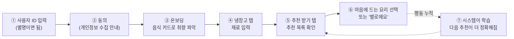

# 01. 전체 개요 — 이 앱은 무엇인가?

> 코드를 보기 **전에** 읽으세요. "무엇을 만드는 건지" 큰 그림을 먼저 잡는 문서입니다.

## 한 문단 소개

**냉장고 요리 추천 시스템**은 사용자가 자기 냉장고에 있는 재료를 입력하면, 그 재료로 만들 수 있는 요리를 **개인 취향·유통기한·시간·날씨**까지 고려해 순위로 추천해 주는 웹앱입니다. 처음엔 누구에게나 똑같은 규칙으로 추천하지만, 사용자가 추천을 고르거나 거부하는 행동이 쌓이면 그 사람만을 위한 **작은 AI 모델**을 자동으로 학습해서 점점 더 그 사람 취향에 맞게 바뀝니다.

기술 스택은 **Streamlit**(파이썬으로 웹 UI를 만드는 도구) + **SQLite**(파일 하나로 동작하는 가벼운 DB) + **scikit-learn**(머신러닝)입니다.

## 사용자가 겪는 흐름 (User Journey)

처음 들어온 사용자가 추천을 받기까지의 여정입니다.

### 각 단계 설명

| 단계 | 사용자가 하는 일 | 시스템이 하는 일 |
|---|---|---|
| ① ID 입력 | 원하는 별명 입력 (`demo` 등) | 그 ID로 데이터를 구분해 저장 |
| ② 동의 | 수집 정보 확인 후 동의 | 동의 시각 기록 (GDPR 스타일) |
| ③ 온보딩 | 좋아하는 음식 카드 고르기 | 초기 **선호 벡터** 생성 (콜드스타트) |
| ④ 냉장고 | 재료 + 유통기한 입력 (직접/음성/영수증) | 보유 재료 목록 저장 |
| ⑤ 추천 받기 | 버튼 클릭 | 보유 재료로 만들 요리를 점수화→정렬 |
| ⑥ 선택/거부 | 요리 카드 선택 | 취향 학습 + 추천 클릭 기록 |
| ⑦ (자동) | — | 기록 50건 넘으면 개인 AI 모델 학습 |

## 입력 방법 3가지 (재료 넣기)

냉장고에 재료를 넣는 방법이 세 가지인데, **뒤 두 개는 선택 기능**(키 없으면 자동 비활성):

1. **직접 입력** — 드롭다운에서 재료 선택 + 날짜 (항상 가능)
2. **음성 입력** — 말하면 받아쓰기(STT) 후 재료 추출 (`STT_ENABLED=true`)
3. **영수증 OCR** — 마트 영수증 사진 → AI가 재료 인식 (`RECEIPT_OCR_ENABLED=true` + LLM 키)

## 3개의 메인 탭

- **🥬 냉장고** — 내 재료 관리
- **🍽️ 추천 받기** — 추천 목록 + "왜 이걸 추천했는지" 설명
- **🌐 공유 갤러리** — 다른 사용자가 공유한 직접 만든 레시피 둘러보기

그리고 운영자(`ADMIN_USER_IDS`에 등록된 사람)만 보이는 **🛡 관리자** 페이지에서 추천 클릭률(CTR), 모델 상태 등을 모니터링합니다.

## 이 앱의 특별한 점 (왜 단순 검색이 아닌가)

단순히 "재료 매칭"만 하는 게 아니라 **5가지를 동시에** 따집니다:

1. **재료 일치도** — 레시피 재료를 얼마나 갖고 있나
2. **소모 우선순위** — 곧 상하는 재료를 먼저 쓰는 요리인가
3. **선호도** — 내가 평소 좋아하는 스타일/맛인가
4. **상황 적합도** — 지금 시간·날씨·계절에 어울리나
5. **다양성** — 한 종류만 추천하지 않도록

이 5가지를 어떻게 합치는지가 이 프로젝트의 핵심이고, [04_recommendation_logic.md](04_recommendation_logic.md)에서 숫자로 따라가 봅니다.

## 다음에 읽을 문서

- 구조가 궁금하면 → [02_architecture.md](02_architecture.md)
- 모르는 용어가 나오면 → [03_glossary.md](03_glossary.md)
- 추천 점수 계산이 궁금하면 → [04_recommendation_logic.md](04_recommendation_logic.md)
