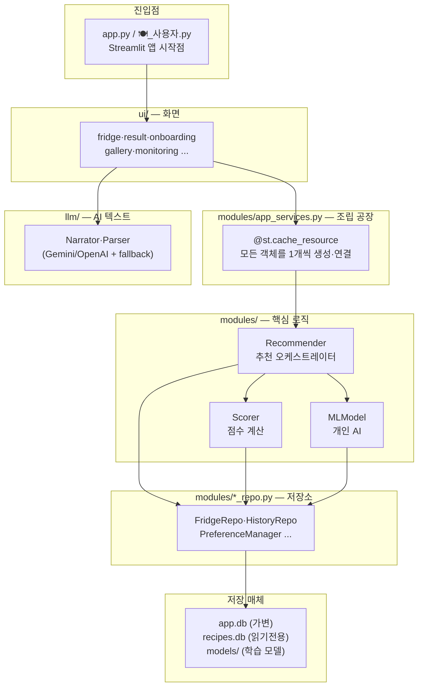
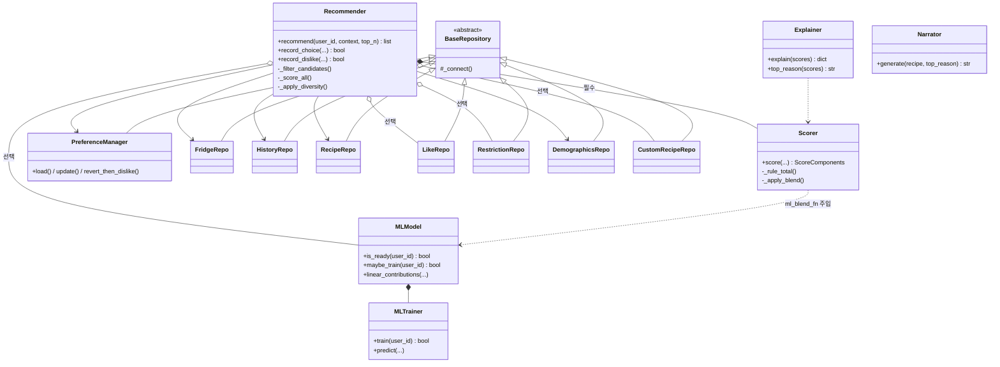
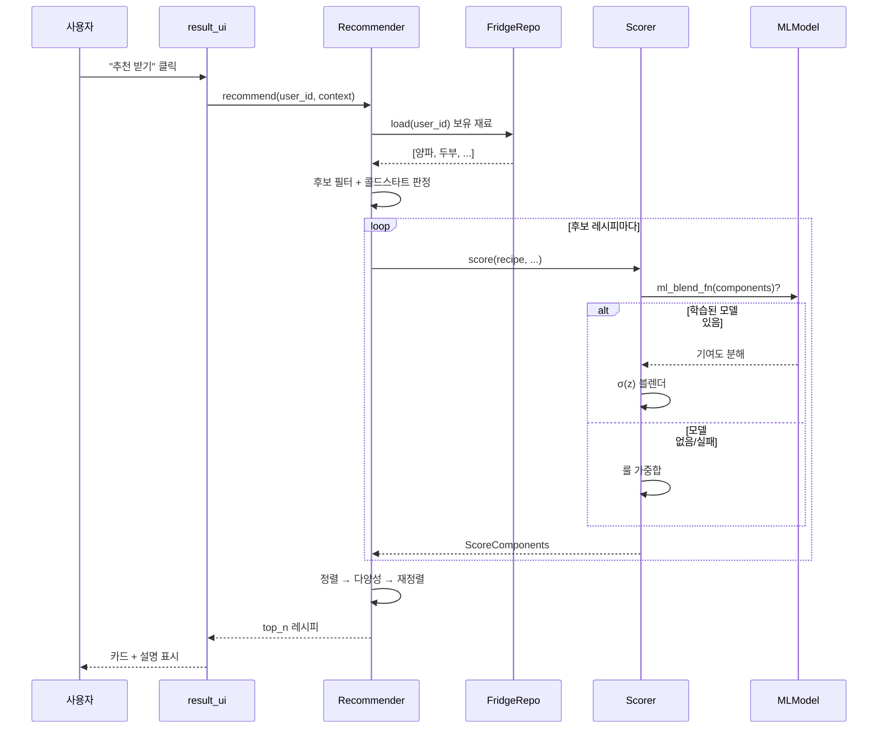

# 02. 아키텍처 — 코드는 어떻게 생겼나?

> "파일이 87개인데 어디부터 봐야 하지?"에 대한 답입니다. 전체 지도(map)를 줍니다.

## 폴더 = 책임 (계층 구조)

이 프로젝트는 **계층(layer)** 으로 나뉘어 있습니다. 위쪽이 사용자에 가깝고, 아래쪽이 데이터에 가깝습니다.



### 폴더별 한 줄 요약

| 폴더/파일 | 책임 | 대표 파일 |
|---|---|---|
| `app.py`, `🍽_사용자.py` | 앱 진입점 (Streamlit 시작) | — |
| `modules/app_services.py` | **조립 공장** — 모든 객체를 만들고 연결 | — |
| `ui/` | 화면(버튼·목록·폼) | `result.py`, `fridge.py` |
| `modules/` | 추천·점수·ML·저장소 등 두뇌 | `recommender.py`, `scorer.py` |
| `llm/` | AI 텍스트 생성 (설명·재료 추출) | `narrator.py` |
| `pages/` | 운영자 전용 페이지 | `1_🛡_관리자.py` |
| `recipes/` | 레시피 카탈로그 빌드 (CSV→DB) | `build_recipes.py` |
| `scripts/` | 시드·재학습 등 보조 도구 | `seed_demo.py` |

## 핵심 개념: app_services는 "조립 공장"

초보자가 가장 헷갈리는 부분입니다. 객체를 직접 `new` 하지 않고 **`get_xxx()` 함수**로 가져옵니다.

```python
# app.py 에서
from modules.app_services import get_recommender
rec = get_recommender()   # 이미 조립된 Recommender를 받음
```

`get_recommender()`는 내부적으로 필요한 저장소들을 모두 모아 `Recommender`를 만들어 줍니다. `@st.cache_resource` 덕분에 **앱 전체에서 딱 한 번만** 생성되고 재사용됩니다(싱글톤).

> 💡 왜 이렇게? 화면이 새로고침(rerun)될 때마다 DB 연결을 다시 만들면 느립니다. 한 번 만들어 캐시하면 빠릅니다.

## 클래스 다이어그램 (핵심 도메인)



**표기 읽는 법**:
- `*--` (채워진 마름모) = **필수 소유**. 없으면 동작 못 함.
- `o--` (빈 마름모) = **선택 소유**. `None`이어도 됨 (예: ML 모델 없이도 추천 가능).
- `-->` = **사용**. 협력자.
- `..>` = **주입/호출**. 느슨한 의존.
- `<|--` = **상속**. 모든 저장소는 `BaseRepository`를 물려받아 DB 연결 코드를 공유.

## 추천 한 번의 호출 흐름 (시퀀스)

"추천 받기" 버튼을 누르면 객체들이 어떤 순서로 대화하는지:



## 두 개의 데이터베이스로 나눈 이유

| DB | 성격 | 담는 것 |
|---|---|---|
| `recipes.db` | **읽기 전용** | 레시피 카탈로그 (변하지 않음) |
| `app.db` | **가변** | 사용자 데이터 (냉장고·기록·선호·좋아요...) |
| `models/` | 디스크 파일 | 학습된 개인 AI 모델 (`.pkl`) |

레시피는 빌드 시 한 번 만들고 안 바뀌니 읽기 전용으로 분리 → 안전하고 빠릅니다.

## 일관되게 지켜지는 설계 원칙: "단일 출처"

이 코드의 가장 중요한 약속입니다. **같은 정보는 한 곳에서만 정의**합니다.

| 정보 | 단일 출처 위치 |
|---|---|
| DB 경로 | `db_paths.py` |
| DB 스키마 | `db_init.py` |
| ML 피처 순서 | `ml_model.FEATURES` 튜플 |
| 시기 적합 (월·계절 통합) | `context.temporal_fit_score()` |
| 재료 정규화 | `normalize.normalize_ingredient()` |

> 💡 왜 중요? 예를 들어 ML 피처 순서가 학습할 때와 예측할 때 다르면 모델이 엉뚱한 결과를 냅니다. 한 곳에서만 정의하면 그런 어긋남이 원천 차단됩니다.

## 다음에 읽을 문서

- 모르는 용어 → [03_glossary.md](03_glossary.md)
- 점수 계산 깊이 보기 → [04_recommendation_logic.md](04_recommendation_logic.md)
