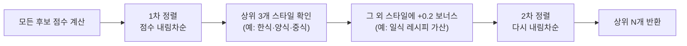

# 04. 추천 로직 — 숫자 하나로 끝까지 따라가기

> 추천 점수가 **실제로 어떻게 계산되는지** 하나의 시나리오로 처음부터 끝까지 따라갑니다.
> 모든 숫자는 실제 코드의 공식 그대로입니다. 용어가 막히면 [03_glossary.md](03_glossary.md).

---

## 시나리오 설정

오늘은 **2026년 6월 2일**(저녁 7시, 비 오는 날)이라고 합시다.

### 사용자 `demo`의 냉장고

| 재료 | 카테고리 | 유통기한 |
|---|---|---|
| 소고기 | 육류 | 2일 후 |
| 양파 | 채소 | 5일 후 |
| 두부 | 콩제품 | **오늘** |

### 사용자 취향 (선호 벡터)
온보딩에서 **한식·담백함**을 좋아한다고 표시 → `{한식: 1.0, 담백함: 0.8}`

### 평가할 레시피: "두부 두루치기" (예시)

| 항목 | 값 |
|---|---|
| 필요 재료 | 돼지고기, 양파, 두부, 마늘 |
| 스타일 | 한식 |
| 맛 | 담백함 |
| 조리시간 | 30분 (→ `medium`) |
| 리뷰 키워드 | 든든함 |
| 어울리는 시간 | 저녁 |
| 어울리는 날씨 | 맑음, 눈 |
| 어울리는 월 | 6월 |

> ℹ️ 이 표는 **공식 설명용 예시**입니다. 실제 `recipes.db`에선 `suitable_weather`가 전 레시피 동일(맑음·비·눈·더위·추위 전부)이라 **날씨 항은 현재 항상 1.0**(변별 없음)이고, `review_keywords`(예: 든든함)도 현재 비어 있습니다 — 두 항은 데이터가 갖춰지면 동작합니다.

이제 이 레시피의 점수를 5요소로 계산합니다.

---

## ① 재료 일치도 (ingredient score) — 가중치 0.35

코드: [`ingredient_matcher.ingredient_score()`](../modules/ingredient_matcher.py#L15)

**1단계 — 정확히 가진 재료 세기**
- 필요: `{돼지고기, 양파, 두부, 마늘}`
- 보유: `{소고기, 양파, 두부}`
- **정확 매치** = `{양파, 두부}` → **2개**

**2단계 — 카테고리 부분 점수** (정확히 없어도 같은 종류면 0.3점)
- 안 쓴 보유 재료: `소고기`(육류)
- 아직 못 채운 필요 재료: `돼지고기`(육류), `마늘`(양념채소)
  - `돼지고기`(육류) ↔ 내가 가진 `소고기`(육류) **같은 카테고리!** → **+0.3** ✅
  - `마늘`(양념채소) ↔ 같은 카테고리 보유 없음 → 0
- 부분 점수 합 `partial` = **0.3**, 카테고리로 메운 수 `covered` = **1**

> 💡 핵심: 소고기 한 개는 돼지고기 슬롯 **하나만** 대체합니다(`Counter`로 소진 관리). 양파 하나가 채소 슬롯 여러 개를 메우는 꼼수를 막습니다.

**3단계 — 결측 페널티**
- 실제 부족 수 `missing` = 4 − 2 = 2
- 카테고리로 1개 메웠으니 `effective_missing` = 2 − 1 = **1**
- `MISSING_PENALTY[1]` = **0.7** (1개 부족은 살려둠 → 탐색성)

**4단계 — 최종 계산**
```
base    = (정확매치 2 + 부분 0.3) / 필요 4 = 2.3 / 4 = 0.575
penalty = 0.7
재료 점수 = min(1.0, 0.575 × 0.7) = 0.403
```

> ✅ **재료 일치도 = 0.403**

---

## ② 소모 우선순위 (consumption score) — 가중치 0.25

코드: [`ingredient_matcher.consumption_score()`](../modules/ingredient_matcher.py#L73)

각 재료의 임박도: `오늘 만료=1.0`, `7일 후=0.0` (선형 감소)

레시피에 **쓰이는** 내 재료만 계산:
| 재료 | 남은 일수 | 임박도 = 1 − 일수/7 |
|---|---|---|
| 양파 | 5일 | 1 − 5/7 = **0.286** |
| 두부 | 0일(오늘) | 1 − 0/7 = **1.0** |
| (소고기) | — | 레시피에 안 쓰임 → 제외 |

```
소모 점수 = (0.286 + 1.0) / 레시피 재료 수 4 = 1.286 / 4 = 0.322
```

> 💡 분모가 "쓰는 재료 수(2)"가 아니라 **"레시피 전체 재료 수(4)"** 입니다. 곧 상하는 두부를 쓰니 점수가 오르되, 재료를 적게 쓰는(집중도 높은) 레시피가 더 유리합니다.

> ✅ **소모 우선순위 = 0.322**

---

## ③ 선호도 (preference score) — 가중치 0.20

코드: [`scorer.preference_score()`](../modules/scorer.py#L54). 두 벡터의 **코사인 유사도**.

내 벡터와 레시피 벡터를 같은 칸에 늘어놓습니다(0이 아닌 것만 표시):

| 차원 | 내 벡터 | 레시피 벡터 |
|---|---|---|
| 한식 | 1.0 | 1 |
| 담백함 | 0.8 | 1 |
| medium(조리시간) | 0 | 1 |
| 든든함(키워드) | 0 | 1 |

```
내적       = 1.0×1 + 0.8×1 = 1.8
내 크기    = √(1.0² + 0.8²) = √1.64 = 1.281
레시피 크기 = √(1+1+1+1) = 2.0
코사인 유사도 = 1.8 / (1.281 × 2.0) = 0.703
```

> ✅ **선호도 = 0.703** (한식·담백함이 겹쳐 높음)

---

## ④ 상황 적합도 (context score) — 가중치 0.15

코드: [`scorer.context_score()`](../modules/scorer.py#L86). `0.55×시간 + 0.29×날씨 + 0.16×월`

| 요소 | 판정 | 점수 |
|---|---|---|
| 시간 | 저녁 7시, 레시피=저녁 → **일치** | 1.0 |
| 날씨 | 비, 레시피=맑음·눈 → **불일치** | 0.25 (페널티) |
| 월 | 6월, 레시피=6월 → **일치** | 1.0 |

```
상황 점수 = 0.55×1.0 + 0.29×0.25 + 0.16×1.0 = 0.55 + 0.0725 + 0.16 = 0.783
```

> 💡 불일치도 0이 아닌 0.25를 줍니다. 날씨가 안 맞아도 재료가 좋으면 추천될 수 있게.

> ✅ **상황 적합도 = 0.783**

---

## ⑤ 다양성 (diversity) — 가중치 0.05

처음엔 **0**. 정렬 후 별도 단계에서 보너스를 줍니다(아래 참고).

> ✅ **다양성 = 0.0**

---

## 합치기 (1): 룰 레짐 — 신규 사용자

코드: [`Scorer._rule_total()`](../modules/scorer.py#L180). 데이터가 없으면 **고정 가중치**로 더합니다.

```
base = 0.35×재료  + 0.25×소모  + 0.20×선호  + 0.15×상황  + 0.05×다양성
     = 0.35×0.403 + 0.25×0.322 + 0.20×0.703 + 0.15×0.783 + 0.05×0
     = 0.141    + 0.081     + 0.141     + 0.117     + 0
     = 0.480
```

> 🎯 **룰 레짐 최종 점수 = 0.480**

이 점수로 모든 후보 레시피를 정렬해 순위를 매깁니다.

---

## 합치기 (2): 블렌더 레짐 — 학습된 사용자

코드: [`Scorer._apply_blend()`](../modules/scorer.py#L187). 기록 50건이 쌓이면, 이 사용자만의 **로지스틱 회귀(LR)** 가 5요소를 합칩니다.

ML 피처는 5개입니다(규칙 4점수 + 시기 적합 서수):
```
x = [재료 0.403, 소모 0.322, 선호 0.703, 상황 0.783, 시기적합 1.0]
```

이 사용자는 그동안 **"유통기한 임박 재료를 쓰는 요리"를 자주 골랐다**고 합시다. 그러면 학습된 가중치 `w`에서 소모 항이 커집니다 (예시 값):

| 피처 | 가중치 wᵢ | 값 xᵢ | 기여도 wᵢ·xᵢ |
|---|---|---|---|
| 재료 일치도 | 0.5 | 0.403 | 0.202 |
| **소모 우선순위** | **2.0** | 0.322 | **0.644** ← 가장 큼 |
| 선호도 | 0.3 | 0.703 | 0.211 |
| 상황 적합도 | 0.8 | 0.783 | 0.626 |
| 시기 적합 | 0.6 | 1.0 | 0.600 |
| (절편 b) | | | −1.5 |

```
z    = -1.5 + (0.202 + 0.644 + 0.211 + 0.626 + 0.600) = 0.783
base = σ(z) = 1 / (1 + e^−0.783) = 0.686
```

> 🎯 **블렌더 레짐 최종 점수 = 0.686**

### 같은 레시피, 다른 점수 — 왜?

| 레짐 | 점수 | 의미 |
|---|---|---|
| 룰 (신규) | 0.480 | 모두에게 동일한 규칙 |
| 블렌더 (학습됨) | 0.686 | 이 사람은 **소모 우선순위를 중시** → 그 점수가 높은 이 레시피를 더 띄워줌 |

### "왜 이 추천?"을 정확히 설명 (XAI)

블렌더의 기여도 표를 보면 **소모 우선순위(0.644)** 가 가장 큽니다. 그래서 [`Explainer`](../modules/explainer.py)가 사용자에게 *"유통기한이 임박한 재료를 활용할 수 있어요"* 를 1순위 이유로 보여줍니다. 그리고 `절편 + 기여도 합 = z` 가 **정확히** 맞아떨어지므로(충실성 불변식), 이 설명은 모델의 진짜 계산과 일치합니다 — 꾸며낸 게 아닙니다.

---

## 마지막 단계: 정렬 → 다양성 → 재정렬

코드: [`Recommender.recommend()`](../modules/recommender.py#L53)

위 점수를 모든 후보에 대해 구한 뒤:



**예시**: 1차 정렬에서 상위 3개가 모두 한식이면, 4등 양식 레시피에 다양성 보너스(`0.05 × 0.2 = 0.01`)를 줍니다. 큰 값은 아니지만 비슷한 점수일 때 다른 스타일을 한 칸 올려, **한식만 5개 뜨는 쏠림**을 막습니다.

---

## 사용자가 선택하면? (학습 루프)

추천 중 하나를 고르면 [`record_choice()`](../modules/recommender.py#L96)가:

1. **선호 벡터 갱신** — 전체에 ×0.95(망각) 후, 고른 레시피 특성에 +1.0
2. **기록 저장** — 점수·상황·시기 적합(temporal_fit)을 history에 스냅샷
3. **학습 트리거** — 기록이 50건+ 이고 조건 맞으면 개인 AI 재학습

'별로에요'를 누르면 반대로 되돌립니다(−1.5 ≈ 선택 +1.0 근사 상쇄 + 패널티 −0.5; 감쇠는 미복원이라 정확한 역연산은 아님). 이렇게 행동이 쌓이며 **룰 → 블렌더로 자연스럽게 진화**합니다.

---

## 한 장 요약

```
재료 0.403 ─┐
소모 0.322 ─┤   룰: 고정 가중치 합 ──────────→ 0.480
선호 0.703 ─┼─→                                  (신규 사용자)
상황 0.783 ─┤   블렌더: 학습된 σ(b+Σwx) ──────→ 0.686
다양성 0   ─┘                                     (학습된 사용자, 소모 중시)
                         │
                         ▼
            정렬 → 다양성 보너스 → 재정렬 → 상위 N
                         │
                         ▼
            사용자 선택 → 선호 갱신 + 학습 → 다음엔 더 정확
```

이게 이 프로젝트의 심장입니다. 더 깊은 코드는 [02_architecture.md](02_architecture.md)의 시퀀스 다이어그램을 함께 보세요.
