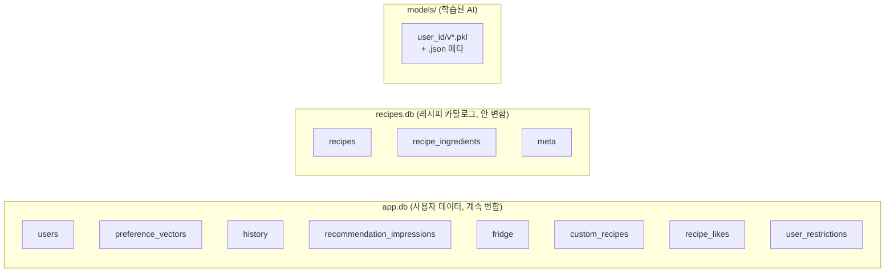
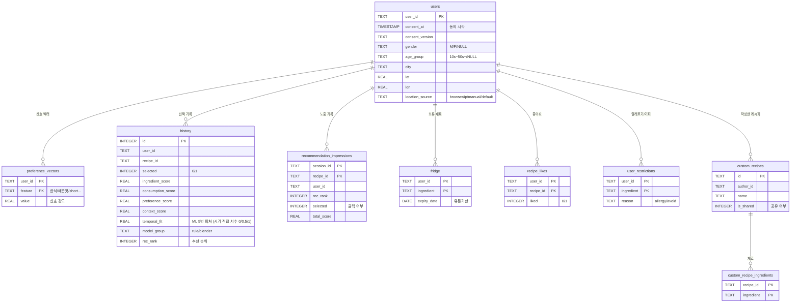

# 05. 데이터 모델 — 데이터는 어디에 어떻게 저장되나?

> 이 앱이 다루는 데이터의 전체 지도입니다. 스키마는 [`db_init.py`](../modules/db_init.py)가 단일 출처입니다.

---

## 3곳에 나눠 저장합니다



**왜 나눴나?**
- `recipes.db`는 빌드 후 안 바뀌니 **읽기 전용**으로 분리 → 안전하고 빠름
- `app.db`는 사용자가 계속 쓰고 바꾸는 데이터 → **가변**
- 학습된 모델은 바이너리라 DB가 아닌 **파일**(`.pkl`)로 저장

---

## app.db — ER 다이어그램

모든 사용자 테이블은 `users.user_id`를 중심으로 연결됩니다.



> 📌 다이어그램에는 핵심 컬럼만 표시했습니다. 전체 컬럼은 [`db_init.py`](../modules/db_init.py)의 `SCHEMA_SQL` 참고.

---

## 테이블별 한 줄 설명

| 테이블 | 역할 | 누가 씀 |
|---|---|---|
| **users** | 사용자 기본 정보 + 동의 + 인구통계 + 위치 | `DemographicsRepo`, `LocationRepo`, `db_init` |
| **preference_vectors** | 사용자 취향을 숫자로 (한식 1.2, 매운맛 0.8...) | `PreferenceManager` |
| **history** | 추천을 **선택/거부한 기록** + 그때의 5점수 → **ML 학습 데이터** | `HistoryRepo` |
| **recommendation_impressions** | 추천 카드가 **보여진** 기록 → CTR(클릭률) 계산 | `RecommendationImpressionRepo` |
| **fridge** | 보유 재료 + 유통기한 | `FridgeRepo` |
| **custom_recipes** (+ingredients) | 사용자가 직접 만든 레시피 | `CustomRecipeRepo` |
| **recipe_likes** | 좋아요 토글 (시스템·커스텀 모두) | `LikeRepo` |
| **user_restrictions** | 알레르기·기피 재료 (하드 필터) | `RestrictionRepo` |
| **recipe_keyword_votes** | LLM 키워드에 대한 사용자 투표 (현재 미연결) | `KeywordVoteRepo` |

### history vs impressions — 헷갈리기 쉬움

- **impressions** = "추천이 화면에 **떴다**" (노출). 떠도 안 누를 수 있음.
- **history** = "사용자가 **선택했다/거부했다**" + 그때의 점수 스냅샷.
- 둘을 비교하면 **CTR = 선택 / 노출** 이 나옵니다. 그리고 history는 ML 학습의 원천입니다.

---

## history 테이블이 특별한 이유 — ML의 연료

`history`는 단순 로그가 아니라 **ML 학습 데이터셋**입니다. 추천을 선택/거부할 때 **그 순간의 5개 피처를 그대로 박제**합니다:

```
ingredient_score, consumption_score, preference_score, context_score,  ← 4개 점수
temporal_fit                                                          ← 시기 적합 서수 (0/0.5/1)
+ selected (0/1)                                                       ← 정답 라벨
```

나중에 `TrainingDataRepository`가 이 행들을 `(X, y)`로 읽어 로지스틱 회귀를 학습합니다. → 자세히는 [06_ml_explained.md](06_ml_explained.md)

> 💡 **단일 출처 주의**: `temporal_fit`은 저장할 때와 ML이 예측할 때 **같은 함수**(`context.temporal_fit_score`)로 계산합니다. 그래야 학습과 예측의 피처가 어긋나지 않습니다. (월·계절은 포함관계라 0/0.5/1 한 서수로 통합 — [06_ml_explained.md](06_ml_explained.md) 참고)

---

## 연결 관리 — 모든 저장소의 공통 규칙

모든 `*_repo.py`는 [`BaseRepository`](../modules/_base_repo.py)를 상속해 동일한 DB 연결 방식을 씁니다:

```python
with self._connect() as con:   # WAL 모드, FK 켜짐, 5초 타임아웃, 자동 close
    con.execute(...)
```

- **WAL 모드** — 읽기와 쓰기가 서로 안 막음 (Streamlit 다중 새로고침 대응)
- **`INSERT OR IGNORE` / `ON CONFLICT`** — 같은 키 중복 입력해도 안전 (멱등)
- **`ensure_user()`** — 쓰기 전 사용자 행이 있는지 보장 (외래키 무결성)

---

## 개인정보 삭제 (동의 철회)

[`delete_user_complete()`](../modules/db_init.py#L232)가 한 사용자의 **모든 흔적**을 외래키 의존 순서대로 지웁니다 — 커스텀 레시피 자식 행 → 좋아요 → 노출 → 기록 → 냉장고 → 선호 → 제한 → users, 그리고 디스크의 학습 모델까지. GDPR 스타일 "잊혀질 권리" 구현입니다.

---

## 다음에 읽을 문서

- 이 데이터로 AI가 어떻게 학습하나 → [06_ml_explained.md](06_ml_explained.md)
