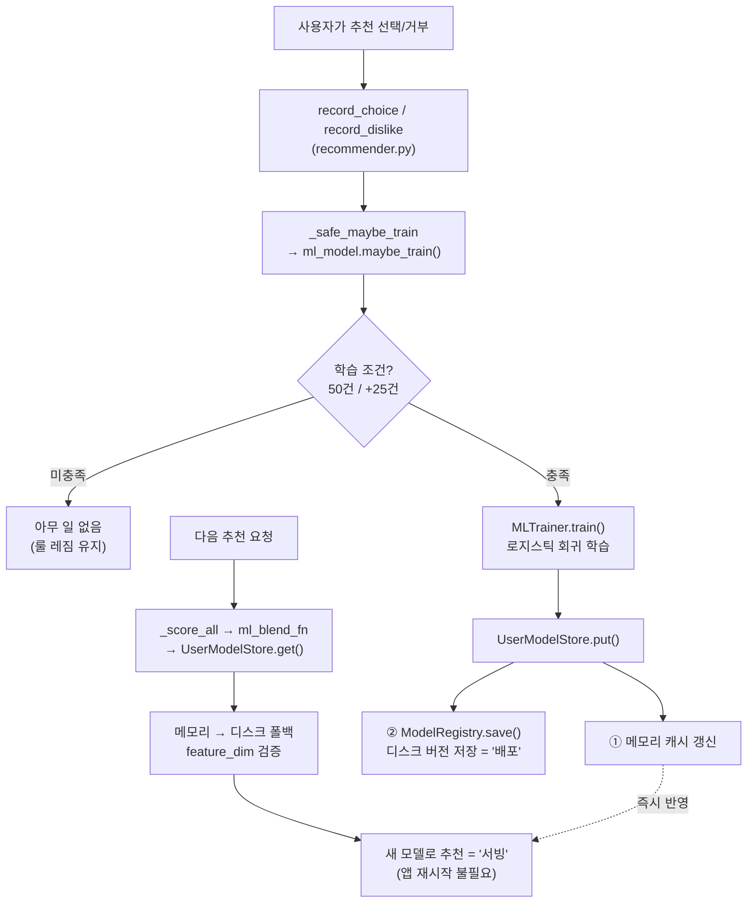

# 06. 머신러닝 쉽게 풀어쓰기

> "사용자 기록 50건이 모이면 무슨 일이 일어나는가?"를 **비전공자 언어**로 설명합니다.
> 수식은 최소화하고 비유로 풉니다. 정확한 코드는 [`ml_model.py`](../modules/ml_model.py), [`ml_trainer.py`](../modules/ml_trainer.py).

---

## 먼저 큰 그림: 규칙에서 개인 AI로

이 앱은 처음엔 **모두에게 같은 규칙**(룰 레짐)으로 추천합니다. 하지만 사용자마다 중요하게 여기는 게 다릅니다:

- 어떤 사람은 **유통기한 임박 재료** 소모를 중시
- 어떤 사람은 **자기 취향(맛·스타일)** 을 중시
- 어떤 사람은 **상황(시간·날씨)** 을 중시

이 "사람마다 다른 비중"을 데이터로 배우는 게 **개인 AI 모델**입니다.


---

## 로지스틱 회귀란? (비유로)

**로지스틱 회귀(Logistic Regression)** 는 "여러 입력을 보고 **예/아니오 확률**을 매기는" 가장 기본적인 머신러닝입니다.

> 🍳 **비유**: 요리 심사위원이 5개 항목(재료·신선도·취향·상황·...)에 점수를 매기고, 각 항목에 **자기만의 중요도(가중치)** 를 곱해 합산한 뒤, "이 손님이 이걸 고를까?"를 0~100%로 예측하는 것과 같습니다.

이 앱에서는:
- **입력(피처)** = 규칙 점수 4개 + 시기 적합 = 5개 숫자
- **출력** = "이 사용자가 이 추천을 **선택할 확률**" (0~1)
- **학습** = 과거 선택/거부 기록을 보고 "이 사람은 어떤 항목을 중시하는지" 가중치를 알아냄

---

## 5개의 입력 (피처)

코드: [`ml_model.FEATURES`](../modules/ml_model.py#L22)

| # | 피처 | 의미 |
|---|---|---|
| 1 | 재료 일치도 | 레시피 재료를 얼마나 가졌나 |
| 2 | 소모 우선순위 | 곧 상하는 재료를 쓰나 |
| 3 | 선호도 | 내 취향에 맞나 |
| 4 | 상황 적합도 | 지금 시간·날씨에 맞나 |
| 5 | **시기 적합** | 지금 시기에 어울리나 (서수 0.0 / 0.5 / 1.0) |

> 💡 **시기 적합은 왜 0/0.5/1 세 단계인가?** 한 숫자에 "얼마나 제철에 가까운지"를 담습니다.
> - **1.0** — 지금 달이 레시피의 적합 달에 딱 들어맞음 (예: 9월에 송편)
> - **0.5** — 달은 안 맞지만 같은 계절은 맞음 (예: 11월 김장찌개를 9월에 — 둘 다 가을)
> - **0.0** — 계절도 안 맞음 (예: 여름 빙수를 겨울에)
>
> **왜 '월 적합'·'계절 적합' 두 피처를 하나로 합쳤나?** 달이 맞으면 계절은 **자동으로** 맞습니다(9월이 맞으면 가을도 맞음). 즉 두 신호는 겹치는 부분이 많아 따로 두면 같은 정보를 중복으로 셉니다. 게다가 대부분의 레시피는 적합 달이 한 계절을 통째로 덮어("가을"=9·10·11월) 두 신호가 **완전히 똑같아집니다**. 그래서 실제로 구분되는 정보(계절만 맞는 0.5 단계)만 살려 한 서수로 합쳤습니다.

---

## "학습한다"는 게 정확히 뭔가?

코드: [`MLTrainer.train()`](../modules/ml_trainer.py#L32)

1. `history` 테이블에서 이 사용자의 과거 기록을 모두 읽음 → `(X, y)`
   - `X` = 각 기록의 5개 피처
   - `y` = 그때 선택했나(1) 거부했나(0)
2. **최신 기록일수록 더 중요하게** 가중 (`0.95^거리`) — 옛날 취향보다 요즘 취향 우선
3. scikit-learn의 `LogisticRegression`이 "선택을 가장 잘 설명하는 가중치"를 자동으로 찾음
4. 학습된 모델을 **디스크 + 메모리에 저장**

```python
# 실제 코드: DECAY_RATE ** np.arange(n-1, -1, -1)
# 최신 기록일수록 지수가 작음 → 가중치가 큼
#   가장 최신: 0.95^0   = 1.0  (가장 중요)
#   가장 오래됨: 0.95^(n-1) ≈ 0  (거의 무시)
sample_weight = 0.95 ** (최신으로부터_떨어진_거리)
model = LogisticRegression(C=1.0, max_iter=1000)
model.fit(X, y, sample_weight=...)     # 최신성 가중 학습
```

> 💡 **0.95의 일관성**: 선호 벡터도 매 갱신마다 ×0.95로 망각합니다. ML 학습 가중도 같은 0.95. **"오래된 건 덜 본다"는 원칙을 두 곳에서 똑같이** 적용합니다.

---

## 언제 학습하나? (활성화 & 재학습)

코드: [`MLModel.maybe_train()`](../modules/ml_model.py#L82)

| 조건 | 동작 |
|---|---|
| 기록 < 50건 | 학습 안 함, **룰 레짐 유지** |
| 기록 ≥ 50건 + 모델 없음 | **첫 학습** |
| 마지막 학습 후 +25건 누적 | **재학습** |
| 선택만 있거나 거부만 있음 | 학습 보류 (예/아니오 구분 불가) |

> 🐛 **과거 버그 교훈** (코드 주석에 남아있음): 예전엔 "기록 수가 50, 75, 100... 격자에 딱 맞을 때"만 학습했습니다. 그런데 시드로 60건이 한 번에 들어온 사용자는 그 격자를 영영 못 맞춰 **학습이 안 되는 버그**가 있었습니다. 지금은 "마지막 학습 대비 증가량"으로 바꿔 견고해졌습니다.

---

## 자동 학습 → 배포 → 서빙 (별도 배포 단계가 없다)

이 앱의 ML은 **사람이 "재학습 버튼"을 누르거나 서버를 재배포할 필요가 없습니다.**
사용자가 추천을 고르거나 거부하는 **그 순간** 학습이 자동으로 트리거되고, 학습된
모델은 곧바로 저장되어 **다음 추천부터 즉시 적용**됩니다(핫스왑).



### ① 자동 트리거 — 매 피드백마다
코드: [`Recommender.record_choice`](../modules/recommender.py#L96) → [`_safe_maybe_train`](../modules/recommender.py#L150)

선택/거부할 때마다 `maybe_train()`이 호출됩니다. 단, 위의 학습 조건(50건/+25건)을
통과할 때만 실제 학습이 일어나고, 평소엔 그냥 통과합니다. 학습이 **실패해도**
`_safe_maybe_train`이 예외를 삼켜서 사용자 흐름을 막지 않습니다(추천은 계속 동작).

### ② 배포 = 버전 관리된 파일 저장
코드: [`ModelRegistry.save`](../modules/model_registry.py#L42)

학습된 모델은 사용자별 폴더에 **버전 이력**으로 저장됩니다:

```
models/<user_id>/
├── v20260603-142530-123456.pkl   ← 학습된 모델 (joblib 직렬화)
├── v20260603-142530-123456.json  ← 메타 (training_size, train_accuracy, feature_dim)
└── latest.txt                    ← "지금 쓸 버전" 포인터
```

- 파일명에 **마이크로초까지** 넣어 같은 초에 연속 저장돼도 안 덮어씀
- `latest.txt`가 현재 버전을 가리켜, 다음 로드 때 최신을 집어옴
- 과거 버전이 남아 있어 이력 추적·롤백 여지 (운영자 페이지에서 조회)

### ③ 2단 저장소 — 메모리 + 디스크
코드: [`UserModelStore`](../modules/user_model_store.py#L10)

| 계층 | 역할 | 속도 |
|---|---|---|
| **메모리** (`_models` dict) | 학습 직후·조회 시 1차 | 가장 빠름 |
| **디스크** (`ModelRegistry`) | 메모리에 없으면 폴백 로드 | 영속 |

- `put()`: 학습 결과를 **메모리와 디스크에 동시** 저장. 디스크 실패해도 메모리 결과는 유지
- `get()`: **메모리 → 디스크** 순으로 찾음. 학습 직후엔 메모리에 있으니 즉시 반영

### ④ 무중단 적용 (핫스왑)
학습이 끝나면 메모리 캐시(`_models`)가 바로 갱신되므로, **다음 추천 요청에서
`get()`이 새 모델을 돌려줍니다.** 앱 재시작이나 배포 파이프라인이 필요 없습니다.
이게 "사용자가 쓸수록 즉시 똑똑해지는" 느낌의 정체입니다.

### ⑤ 스키마 안전장치 — 구버전 모델 자동 무효화
코드: [`UserModelStore.get`](../modules/user_model_store.py#L32)

피처를 5개에서 6개로 바꾸는 등 **모델 구조가 달라지면**, 디스크에 남은 옛 모델은
입력 차원이 안 맞아 오작동할 수 있습니다. 이를 막기 위해 메타의 `feature_dim`을
현재 값과 비교해 **다르면 그 모델을 무효화(None 반환)** → 룰 레짐으로 폴백하고,
다음 `maybe_train`에서 새 구조로 자동 재학습됩니다.

> 💡 한 줄 요약: **"매 피드백마다 조건 충족 시 재학습 → 버전 파일로 저장 → 메모리
> 핫스왑으로 다음 요청부터 즉시 서빙"**. 연속 학습(continuous training) + 무중단
> 배포가 한 흐름에 녹아 있어, 운영자가 손댈 게 없습니다.

---

## 학습 후: 점수가 어떻게 바뀌나

학습 전(룰)과 후(블렌더)의 차이는 [04. 추천 로직](04_recommendation_logic.md)에서 같은 레시피로 계산해 봤습니다:

| | 룰 레짐 | 블렌더 레짐 |
|---|---|---|
| 점수 합치는 법 | 고정 가중치 | **학습된** 가중치 + 시그모이드 |
| 같은 레시피 점수 | 0.480 | 0.686 |
| 차이의 이유 | — | 이 사람이 "소모 우선순위"를 중시 → 그게 높은 레시피를 띄움 |

---

## 가장 중요한 특징: 설명 가능한 AI (XAI)

대부분의 AI는 "왜 그렇게 판단했는지" 알기 어려운 **블랙박스**입니다. 이 앱은 다릅니다.

로지스틱 회귀의 계산은 **각 피처의 기여도를 그대로 분해**할 수 있습니다:

```
최종 점수 = 절편 + (가중치₁×피처₁) + (가중치₂×피처₂) + ...
                    └─ 재료 기여 ─┘   └─ 소모 기여 ─┘
```

코드: [`MLTrainer.linear_contributions()`](../modules/ml_trainer.py#L80)는 이 **기여도 하나하나를 그대로 반환**합니다. 그래서:

- 사용자에게 *"유통기한 임박 재료를 활용할 수 있어요"* (가장 큰 기여)를 보여줄 수 있고
- **충실성 불변식**: `절편 + 기여도 합 = 모델의 실제 계산값` 이 정확히 성립 → 설명이 거짓말이 아님


---

## 안전장치들

ML은 망가질 수 있으므로 여러 폴백이 있습니다:

| 상황 | 대응 |
|---|---|
| 모델 학습 실패 | 조용히 **룰 레짐**으로 폴백 (사용자 흐름 안 막음) |
| 피처 차원 안 맞음 (구버전 모델) | `feature_dim` 메타로 자동 무효화 → 룰 폴백 |
| 선택/거부 한쪽만 있음 | 학습 보류 |
| 기록 부족 | 룰 레짐 유지 |

> 💡 핵심 철학: **ML이 안 되더라도 앱은 항상 동작한다.** ML은 "있으면 더 좋은" 보강일 뿐, 필수가 아닙니다.

---

## 평가는 어떻게? (모델이 좋은지 확인)

운영자 페이지에서 [`RecommendEvaluator`](../modules/recommend_eval.py)가 추천 품질을 측정합니다:

- **CTR** — 추천 중 실제 클릭 비율
- **NDCG / Recall / Hit-rate** — 추천 순위가 얼마나 정확한가
- **룰 vs 블렌더 비교** — ML이 정말 나아졌는지 A/B로 확인
- **드리프트 감지** — 사용자 취향이 급변했는지

---

## 향후 작업(백로그): 진짜 '제철'을 데이터로 배우기

> ⚠️ **지금 구현된 기능이 아닙니다.** 나중에 데이터가 많이 쌓이면 해볼 수 있는 개선 아이디어를 기록해 둡니다. (우선순위 낮음)

**지금 상태가 뭐냐면.** 레시피의 "어울리는 달(`suitable_month`)"은 사람이 일일이 정한 게 아니라 **계절을 기계적으로 펼친 값**입니다. 예를 들어 "가을 음식"이라고만 적으면 자동으로 9·10·11월로 깔립니다. 그래서 시기 적합(`temporal_fit`)은 사실상 "계절이 맞나"만 보고, **진짜 월 단위 정보는 명절·제철 4개(삼계탕·송편·떡국·갈비찜)에만** 있습니다.

**아이디어.** 앱은 사용자가 추천을 고를 때마다 그 시점의 **"몇 월인지"를 함께 기록**합니다(`history.month`, `recommendation_impressions`). 이게 쌓이면 거꾸로 물어볼 수 있어요 — *"사람들은 실제로 이 음식을 몇 월에 가장 많이 고를까?"*

- 처음엔 "가을 음식"으로 뭉뚱그려 두지만,
- 데이터가 쌓이면 "어, 이건 사실 9월에만 몰리네" 같은 **진짜 제철**을 발견하고,
- 레시피의 적합월을 그 실측값으로 갱신하면 추천이 더 정확해집니다.

> 💡 비유: 가게가 막연히 "겨울 메뉴"로 정해뒀다가, 영수증을 모아 보니 "사실 12월에만 팔리네"를 알게 되는 것과 같습니다.

**주의 — 왜 '선택 횟수'가 아니라 'CTR'인가.** 추천기가 어떤 음식을 더 자주 **보여주면** 당연히 더 많이 선택됩니다. 그래서 "몇 번 선택됐나(raw)" 대신 **"보여준 것 대비 선택된 비율(CTR)"** 로 봐야 공정합니다. 다행히 이 앱은 추천이 **재료·취향 위주(점수의 약 80%)** 라, 계절과 무관하게 음식이 두루 노출돼서 데이터가 한 계절에 갇히지 않습니다 (계절은 점수의 약 2%뿐).

**왜 우선순위가 낮은가 (영향이 작음).**

- 월은 추천 점수의 **약 2%** 비중뿐입니다(재료·소모·취향이 80%). 월 신호를 완벽히 고쳐도 최종 순위는 조금만 바뀝니다.
- 레시피 180개 중 진짜 월 정보가 의미 있는 건 **4개(명절·제철)** 뿐입니다.
- 통계적으로 의미 있으려면 **실서비스 규모**의 데이터가 필요합니다(데모로는 부족).

**결론.** "여유가 생기면, 명절·제철 음식 한정으로 (레시피×월) CTR을 집계해 적합월을 데이터 기반으로 다듬는다" — **낮은 우선순위 백로그**. 핵심 추천 레버는 여전히 재료·소모·취향입니다.

---

## 한 문장 요약

> 이 앱의 ML은 **"사용자가 과거에 무엇을 골랐는지 보고, 그 사람이 추천 5요소 중 무엇을 중시하는지 가중치로 배워, 다음 추천에 반영하되, 그 판단 근거를 정확한 숫자로 설명할 수 있는"** 작고 투명한 개인화 엔진입니다.

데이터 출처가 궁금하면 → [05. 데이터 모델](05_data_model.md)
