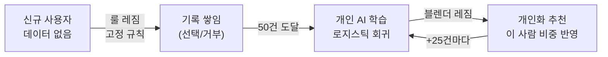
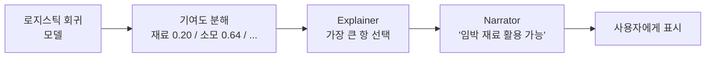

# 06. 머신러닝 쉽게 풀어쓰기

> "사용자 기록 50건이 모이면 무슨 일이 일어나는가?"를 **비전공자 언어**로 설명합니다.
> 수식은 최소화하고 비유로 풉니다. 정확한 코드는 [`ml_model.py`](../modules/ml_model.py), [`ml_trainer.py`](../modules/ml_trainer.py).

---

## 먼저 큰 그림: 규칙에서 개인 AI로

이 앱은 처음엔 **모두에게 같은 규칙**(룰 레짐)으로 추천합니다. 하지만 사용자마다 중요하게 여기는 게 다릅니다:

- 어떤 사람은 **유통기한 임박 재료** 소모를 중시
- 어떤 사람은 **자기 취향(맛·스타일)** 을 중시
- 어떤 사람은 **상황(시간·날씨)** 을 중시

이 "사람마다 다른 비중"을 데이터로 배우는 게 **개인 AI 모델**입니다.



---

## 로지스틱 회귀란? (비유로)

**로지스틱 회귀(Logistic Regression)** 는 "여러 입력을 보고 **예/아니오 확률**을 매기는" 가장 기본적인 머신러닝입니다.

> 🍳 **비유**: 요리 심사위원이 5개 항목(재료·신선도·취향·상황·...)에 점수를 매기고, 각 항목에 **자기만의 중요도(가중치)** 를 곱해 합산한 뒤, "이 손님이 이걸 고를까?"를 0~100%로 예측하는 것과 같습니다.

이 앱에서는:
- **입력(피처)** = 추천 점수 5요소를 정제한 6개 숫자
- **출력** = "이 사용자가 이 추천을 **선택할 확률**" (0~1)
- **학습** = 과거 선택/거부 기록을 보고 "이 사람은 어떤 항목을 중시하는지" 가중치를 알아냄

---

## 6개의 입력 (피처)

코드: [`ml_model.FEATURES`](../modules/ml_model.py#L21)

| # | 피처 | 의미 |
|---|---|---|
| 1 | 재료 일치도 | 레시피 재료를 얼마나 가졌나 |
| 2 | 소모 우선순위 | 곧 상하는 재료를 쓰나 |
| 3 | 선호도 | 내 취향에 맞나 |
| 4 | 상황 적합도 | 지금 시간·날씨에 맞나 |
| 5 | **월 적합** | 지금 달(예: 6월)에 어울리나 |
| 6 | **계절 적합** | 지금 계절(예: 여름)에 어울리나 |

> 💡 왜 월과 계절을 나눴나? "6월에 딱 맞는" 신호와 "여름 전체에 맞는" 더 느슨한 신호는 사람마다 다르게 작동합니다. 둘을 분리하면 모델이 데이터가 쌓이면서 **어느 쪽이 그 사람에게 중요한지 스스로 배분**합니다.

---

## "학습한다"는 게 정확히 뭔가?

코드: [`MLTrainer.train()`](../modules/ml_trainer.py#L32)

1. `history` 테이블에서 이 사용자의 과거 기록을 모두 읽음 → `(X, y)`
   - `X` = 각 기록의 6개 피처
   - `y` = 그때 선택했나(1) 거부했나(0)
2. **최신 기록일수록 더 중요하게** 가중 (`0.95^거리`) — 옛날 취향보다 요즘 취향 우선
3. scikit-learn의 `LogisticRegression`이 "선택을 가장 잘 설명하는 가중치"를 자동으로 찾음
4. 학습된 모델을 **디스크 + 메모리에 저장**

```python
# 실제 코드: DECAY_RATE ** np.arange(n-1, -1, -1)
# 최신 기록일수록 지수가 작음 → 가중치가 큼
#   가장 최신: 0.95^0   = 1.0  (가장 중요)
#   가장 오래됨: 0.95^(n-1) ≈ 0  (거의 무시)
sample_weight = 0.95 ** (최신으로부터_떨어진_거리)
model = LogisticRegression(C=1.0, max_iter=1000)
model.fit(X, y, sample_weight=...)     # 최신성 가중 학습
```

> 💡 **0.95의 일관성**: 선호 벡터도 매 갱신마다 ×0.95로 망각합니다. ML 학습 가중도 같은 0.95. **"오래된 건 덜 본다"는 원칙을 두 곳에서 똑같이** 적용합니다.

---

## 언제 학습하나? (활성화 & 재학습)

코드: [`MLModel.maybe_train()`](../modules/ml_model.py#L80)

| 조건 | 동작 |
|---|---|
| 기록 < 50건 | 학습 안 함, **룰 레짐 유지** |
| 기록 ≥ 50건 + 모델 없음 | **첫 학습** |
| 마지막 학습 후 +25건 누적 | **재학습** |
| 선택만 있거나 거부만 있음 | 학습 보류 (예/아니오 구분 불가) |

> 🐛 **과거 버그 교훈** (코드 주석에 남아있음): 예전엔 "기록 수가 50, 75, 100... 격자에 딱 맞을 때"만 학습했습니다. 그런데 시드로 60건이 한 번에 들어온 사용자는 그 격자를 영영 못 맞춰 **학습이 안 되는 버그**가 있었습니다. 지금은 "마지막 학습 대비 증가량"으로 바꿔 견고해졌습니다.

---

## 학습 후: 점수가 어떻게 바뀌나

학습 전(룰)과 후(블렌더)의 차이는 [04. 추천 로직](04_recommendation_logic.md)에서 같은 레시피로 계산해 봤습니다:

| | 룰 레짐 | 블렌더 레짐 |
|---|---|---|
| 점수 합치는 법 | 고정 가중치 | **학습된** 가중치 + 시그모이드 |
| 같은 레시피 점수 | 0.480 | 0.686 |
| 차이의 이유 | — | 이 사람이 "소모 우선순위"를 중시 → 그게 높은 레시피를 띄움 |

---

## 가장 중요한 특징: 설명 가능한 AI (XAI)

대부분의 AI는 "왜 그렇게 판단했는지" 알기 어려운 **블랙박스**입니다. 이 앱은 다릅니다.

로지스틱 회귀의 계산은 **각 피처의 기여도를 그대로 분해**할 수 있습니다:

```
최종 점수 = 절편 + (가중치₁×피처₁) + (가중치₂×피처₂) + ...
                    └─ 재료 기여 ─┘   └─ 소모 기여 ─┘
```

코드: [`MLTrainer.linear_contributions()`](../modules/ml_trainer.py#L75)는 이 **기여도 하나하나를 그대로 반환**합니다. 그래서:

- 사용자에게 *"유통기한 임박 재료를 활용할 수 있어요"* (가장 큰 기여)를 보여줄 수 있고
- **충실성 불변식**: `절편 + 기여도 합 = 모델의 실제 계산값` 이 정확히 성립 → 설명이 거짓말이 아님



---

## 안전장치들

ML은 망가질 수 있으므로 여러 폴백이 있습니다:

| 상황 | 대응 |
|---|---|
| 모델 학습 실패 | 조용히 **룰 레짐**으로 폴백 (사용자 흐름 안 막음) |
| 피처 차원 안 맞음 (구버전 모델) | `feature_dim` 메타로 자동 무효화 → 룰 폴백 |
| 선택/거부 한쪽만 있음 | 학습 보류 |
| 기록 부족 | 룰 레짐 유지 |

> 💡 핵심 철학: **ML이 안 되더라도 앱은 항상 동작한다.** ML은 "있으면 더 좋은" 보강일 뿐, 필수가 아닙니다.

---

## 평가는 어떻게? (모델이 좋은지 확인)

운영자 페이지에서 [`RecommendEvaluator`](../modules/recommend_eval.py)가 추천 품질을 측정합니다:

- **CTR** — 추천 중 실제 클릭 비율
- **NDCG / Recall / Hit-rate** — 추천 순위가 얼마나 정확한가
- **룰 vs 블렌더 비교** — ML이 정말 나아졌는지 A/B로 확인
- **드리프트 감지** — 사용자 취향이 급변했는지

---

## 한 문장 요약

> 이 앱의 ML은 **"사용자가 과거에 무엇을 골랐는지 보고, 그 사람이 추천 5요소 중 무엇을 중시하는지 가중치로 배워, 다음 추천에 반영하되, 그 판단 근거를 정확한 숫자로 설명할 수 있는"** 작고 투명한 개인화 엔진입니다.

데이터 출처가 궁금하면 → [05. 데이터 모델](05_data_model.md)
