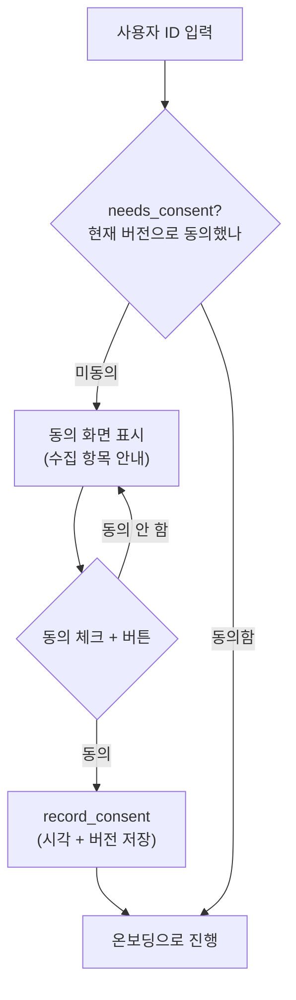
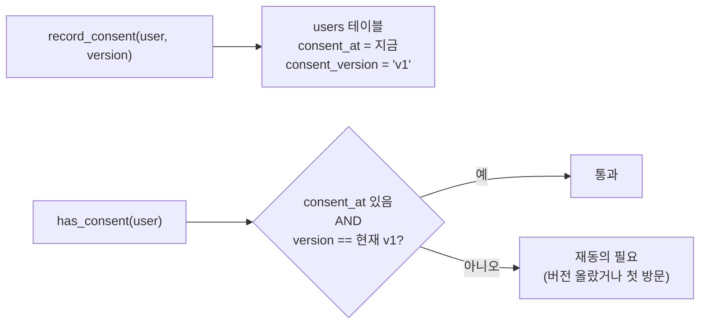
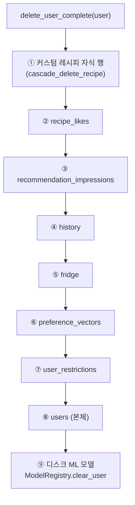

# 08. 동의 · 개인정보 생명주기 (GDPR 스타일)

> 이 앱이 **무엇을 수집한다고 사용자에게 알리고, 어떻게 동의받고, 어떻게 전부 지우는지**의 전체 흐름입니다.
> 코드: [`ui/consent.py`](../ui/consent.py), [`modules/db_init.py`](../modules/db_init.py)

---

## 큰 그림 — 3개의 관문(gate) 중 첫 번째

앱에 들어오면 **동의 → 온보딩 → 메인**順으로 관문을 통과합니다([app.py:202-220](../app.py#L202)). 동의는 그 첫 관문으로, **동의하지 않으면 서비스가 아예 차단**됩니다.

---

## ① 무엇을 수집하는지 투명하게 고지

[`consent.py`](../ui/consent.py)는 수집 항목을 **3개 목록**으로 나눠 단일 출처로 관리합니다(동의 화면과 사이드바 요약이 같은 텍스트 공유):

| 목록 | 내용 | 코드 |
|---|---|---|
| **저장되는 정보** | 별명, 선호 스타일·맛, 알레르기, 냉장고 재료, 추천 클릭 기록, 커스텀 레시피, (선택) 성별·나이대 | `COLLECTED_DATA` |
| **외부 전송** | Gemini/OpenAI(설명 생성, **식별정보 없이** 레시피 메타만), 음성(로컬 처리, 전송 0) | `EXTERNAL_DATA` |
| **수집 안 함** | 이름·이메일·전화번호, 건강·의료 정보 | `NOT_COLLECTED` |

추가로 **의료 면책** 고지: 알레르기 필터는 단순 텍스트 매칭이며 의학적 진단이 아님을 명시합니다.

> 💡 왜 목록을 코드 상수로? 화면과 사이드바 두 곳이 **같은 안내문**을 보여줘야 하므로, 텍스트를 한 곳(`COLLECTED_DATA` 등)에만 정의해 어긋남을 막습니다(단일 출처 원칙).

---

## ② 동의 버전 관리 — 정책 바뀌면 재동의

코드: [`db_init.py`](../modules/db_init.py#L9) `CONSENT_VERSION = "v1"`

동의는 **버전과 함께** 기록됩니다. 수집 항목이 바뀌면 운영자가 `CONSENT_VERSION`을 올리고, 그러면 **모든 기존 사용자가 자동으로 재동의 화면**을 다시 보게 됩니다.

핵심 함수 ([db_init.py:182-228](../modules/db_init.py#L182)):
- `record_consent(db, user, version)` — 동의 시각 + 버전 저장
- `has_consent(db, user)` — **현재 버전으로** 동의했는지 (옛 버전 동의는 무효)
- `get_consent_info(db, user)` — 동의 기록 조회 (사이드바 표시용)

---

## ③ 잊혀질 권리 — 완전 삭제

코드: [`db_init.py:231-268`](../modules/db_init.py#L231) `delete_user_complete()`

사용자가 "데이터 삭제 요청 → 확인 체크 → 영구 삭제"를 누르면([consent.py:158-167](../ui/consent.py#L158)), 그 사용자의 **모든 흔적**을 지웁니다. 외래키 의존 순서대로 자식부터 삭제해 무결성 위반을 막습니다:

> 💡 **DB뿐 아니라 디스크 모델까지**: `models/<user_id>/` 폴더의 학습된 `.pkl`도 함께 지웁니다([db_init.py:262-268](../modules/db_init.py#L262)). 단, user_id가 경로로 안전하지 않으면 DB만 지우고 넘어갑니다(심층 방어).

삭제 직후 UI는 `st.cache_resource.clear()` + `st.session_state.clear()`로 캐시·세션까지 비워 **그 자리에서 완전한 초기화**를 보장합니다([consent.py:164-167](../ui/consent.py#L164)).

---

## 한눈에 — 동의 데이터가 사는 곳

모든 동의 상태는 `users` 테이블의 두 컬럼에 있습니다:

| 컬럼 | 의미 |
|---|---|
| `consent_at` | 동의한 시각 (NULL이면 미동의) |
| `consent_version` | 동의한 정책 버전 (현재 `v1`과 비교) |

→ 데이터 구조 전체는 [05. 데이터 모델](05_data_model.md), 사용자 여정은 [01. 개요](01_overview.md) 참고.

---

## 핵심 요약

> 이 앱의 개인정보 처리는 **"투명한 고지(3목록) → 버전 동의 → 버전 바뀌면 재동의 → 요청 시 DB+모델까지 완전 삭제"**의 한 흐름입니다. 사업화 단계의 JSON export·OAuth·제3자 동의 분리는 [consent.py:130](../ui/consent.py#L130)에 향후 과제로 명시돼 있습니다.
