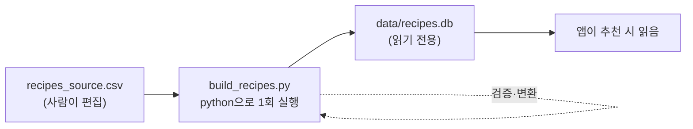
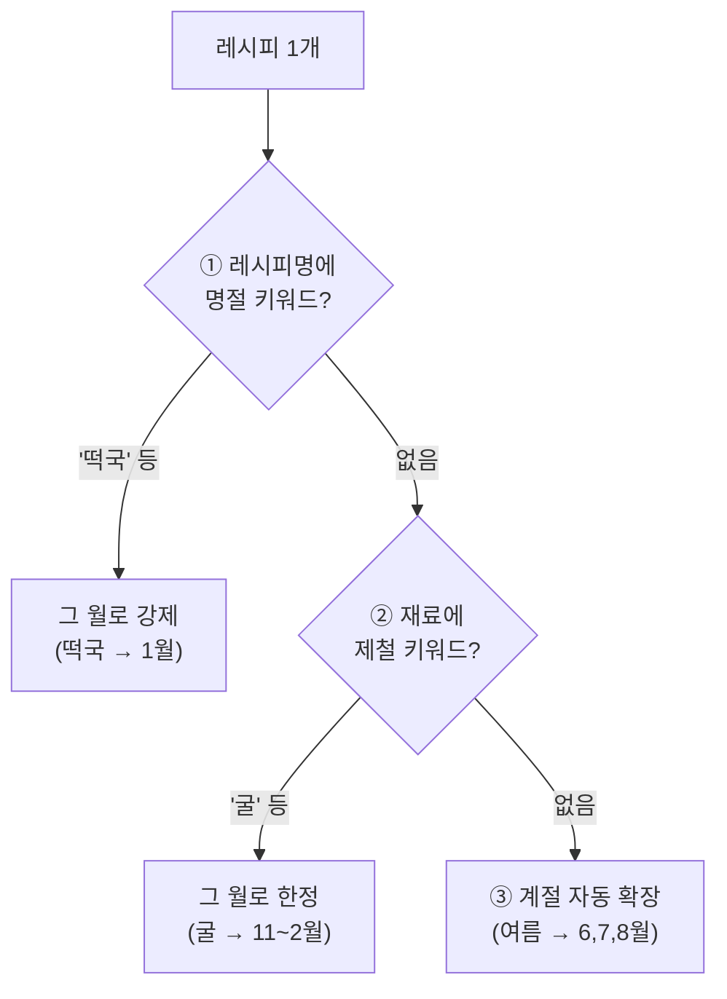

# 09. 레시피 카탈로그 빌드 — 추천 데이터는 어디서 오나

> 추천이 고르는 **레시피 목록(recipes.db)이 어떻게 만들어지는지**입니다. CSV 한 장에서 시작합니다.
> 코드: [`recipes/tools/build_recipes.py`](../recipes/tools/build_recipes.py), 원본: [`recipes/recipes_source.csv`](../recipes/recipes_source.csv)

---

## 큰 그림 — CSV → DB 1회 빌드

레시피는 사람이 **CSV로 편집**하고, 빌드 스크립트가 이를 **읽기 전용 `recipes.db`로 변환**합니다. 앱은 이 DB만 읽습니다(절대 수정 안 함).



실행 ([README](../README.md)):
```bash
python recipes/tools/build_recipes.py   # 최초 1회 (또는 CSV 수정 후 재실행)
```

> 💡 왜 분리? 레시피는 자주 안 바뀌니 빌드 때 한 번 만들고 읽기 전용으로 둡니다 → 안전하고 빠름. 사용자 데이터(`app.db`)와 분리된 이유는 [05. 데이터 모델](05_data_model.md) 참고.

---

## 빌드가 하는 3가지 일

### ① 스키마 재생성 (멱등)
[`SCHEMA_SQL`](../recipes/tools/build_recipes.py#L49)이 `DROP TABLE` 후 다시 만들어, **여러 번 실행해도 항상 깨끗한 최신 상태**가 됩니다. 3개 테이블: `recipes`, `recipe_ingredients`, `meta`.

### ② 행마다 검증 + 변환
CSV 한 행 → 레시피 한 개. ID는 `r001`, `r002`... 순번으로 자동 부여([build_recipes.py:144](../recipes/tools/build_recipes.py#L144)). 각 필드를 `validate_enum`으로 검증하고(잘못된 값은 그 행만 스킵), 두 가지를 **자동 추론**합니다:

- **맛(taste)**: 재료에서 자동 추론 (`infer_taste`) — 사람이 안 적어도 됨
- **어울리는 월(suitable_month)**: 계절 입력 → 월로 확장 (아래 ③)

### ③ 메타 기록
버전(`VERSION = "1.1.0"`), 빌드 날짜, 레시피 수를 `meta` 테이블에 저장. 앱 사이드바의 "레시피 DB v..." 표시가 이 값입니다.

---

## 핵심: 계절 → 월 확장 (3단계 우선순위)

CSV에는 사람이 **계절**("여름")만 적지만, 추천은 더 정밀한 **월**(6월/7월/8월) 단위로 작동합니다([why는 03 용어사전의 month vs season](03_glossary.md)). 빌드가 이 변환을 합니다 — 단, **명절·제철은 더 좁게** 한정하는 3단계 우선순위가 있습니다([`infer_months`](../recipes/tools/build_recipes.py#L113)):



| 우선순위 | 규칙 | 예시 | 코드 |
|---|---|---|---|
| 1 (명절) | 레시피명 키워드 → 특정 월 | 떡국→1월, 삼계탕→7·8월(복날), 송편→9월 | `EVENT_MONTH_OVERRIDES` |
| 2 (제철) | 재료 키워드 → 제철 월 | 굴→11·12·1·2월, 전어→9·10월 | `INGREDIENT_MONTH_OVERRIDES` |
| 3 (계절) | 계절 → 월 목록 | 봄→3·4·5월, 겨울→12·1·2월 | `SEASON_TO_MONTHS` |

> 💡 왜 우선순위? "삼계탕"은 여름 음식이지만 특히 **복날(7~8월)**에 강합니다. 계절 변환(여름=6·7·8)보다 명절 규칙이 우선해야 더 정확한 시즌 추천이 됩니다.

---

## 결과물: recipes.db 구조

| 테이블 | 내용 | 주요 컬럼 |
|---|---|---|
| `recipes` | 레시피 본체 | id, name, style, taste, cook_time, difficulty, suitable_time/weather/**month** |
| `recipe_ingredients` | 레시피-재료 (1:N) | recipe_id, ingredient (PK 묶음) |
| `meta` | 카탈로그 메타 (key/value 테이블) | key, value — rows: version·updated_at·recipe_count |

`suitable_month`는 `"1월,9월"` 같은 콤마 문자열로 저장됩니다([build_recipes.py:196](../recipes/tools/build_recipes.py#L196)). 이게 나중에 추천 시 [`temporal_fit_score`](../modules/context.py)로 "지금이 이 레시피에 얼마나 제철인가(0/0.5/1)" 판정의 입력이 됩니다.

---

## 레시피를 추가하려면? (How-to)

1. [`recipes/recipes_source.csv`](../recipes/recipes_source.csv)에 행 추가 (name, style, ingredients, cook_time, difficulty, suitable_time, suitable_weather, suitable_season)
2. `python recipes/tools/build_recipes.py` 재실행
3. 맛(taste)·어울리는 월은 **자동 추론**됩니다 — CSV에 `taste` 열은 없고 `infer_taste`가 ingredients 로 생성
4. 잘못된 enum 값(예: 없는 style)이면 그 행만 스킵되고 경고 출력 → 콘솔 확인

> ⚠️ 정규화 일관성: 재료는 `normalize_ingredient`로 표준화되어 저장됩니다. 같은 함수를 추천 시 보유 재료에도 적용하므로([normalize.py](../modules/normalize.py)), "양파"와 "양 파"가 어긋나지 않습니다.

---

## 핵심 요약

> 레시피 카탈로그는 **"CSV 편집 → 1회 빌드(검증·맛 추론·계절→월 3단계 확장) → 읽기 전용 recipes.db"**로 만들어집니다. 명절·제철 오버라이드 덕분에 단순 계절 변환보다 정밀한 시즌 추천이 가능합니다.

→ 이 데이터가 추천에서 어떻게 쓰이는지 [04. 추천 로직](04_recommendation_logic.md), 저장 구조는 [05. 데이터 모델](05_data_model.md).
