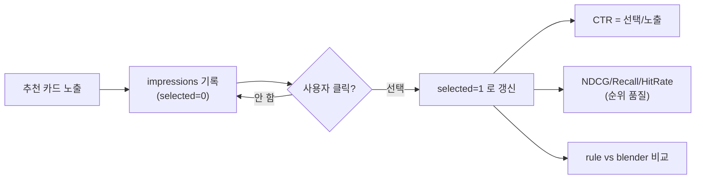

# 10. 좋아요 보너스 · 측정과 평가

> 두 가지를 다룹니다: ① 좋아요가 추천 점수에 더해지는 **공식**, ② 시스템이 자기 성능을 재는 **CTR·A/B·평가지표**.
> 코드: [`like_repo.py`](../modules/like_repo.py), [`metrics.py`](../modules/metrics.py), [`recommend_eval.py`](../modules/recommend_eval.py)

---

# 1부. 좋아요 보너스 (점수 6번째 요소)

[04. 추천 로직](04_recommendation_logic.md)에서 점수 5요소를 다뤘는데, 최종 `total`에는 **좋아요 보너스(`like_bonus`)**도 더해집니다. 04에선 0으로 뒀던 그 항의 정체입니다.

```
total = base(룰 또는 블렌더) + like_bonus
```

## 왜 단순 "좋아요 수"가 아닌가

그냥 좋아요 개수를 쓰면 **인기 레시피가 영원히 1등**이 되어 다양성이 죽습니다. 그래서 두 가지 장치를 씁니다 ([like_repo.py](../modules/like_repo.py#L57)):

### ① 시간 가중 (오래된 좋아요는 약하게)
```
weighted = Σ 0.5 ^ (지난 일수 / 180)
```
반감기 **180일**(약 반년). 6개월 전 좋아요는 영향이 절반으로 줆 → **최근에 사랑받는** 레시피가 더 유리. 음식 트렌드 사이클을 반영합니다.

### ② 로그 포화 (많아도 폭주 안 함)
```
like_bonus = 0.05 × log(1+weighted) / log(1+10),  최대 0.05
```
`log`를 써서 좋아요가 10개든 100개든 보너스가 **0.05를 넘지 않게** 상한을 둡니다. "어느 정도 인기면 충분, 그 이상은 큰 차이 없음"이라는 포화 곡선.

| 가중 좋아요 수 | 보너스(근사) |
|---|---|
| 1개 | 0.05 × log(2)/log(11) ≈ 0.014 |
| 10개 | 0.05 × log(11)/log(11) = **0.050 (상한)** |
| 100개 | 상한에 걸려 여전히 0.050 |

> 💡 핵심: 시간 가중 + 로그 포화 = **"최근 인기는 살짝 밀어주되, 한 레시피가 추천을 독점하지 못하게"**. 보너스 상한 0.05는 5요소 중 다양성 가중치와 같은 작은 값이라, 비슷한 점수일 때만 순위를 바꿉니다.

좋아요 자체는 토글이며([`toggle_like`](../modules/like_repo.py#L21)), `recipe_likes` 테이블에 저장됩니다([05. 데이터 모델](05_data_model.md)).

---

# 2부. 시스템이 자기 성능을 재는 법

추천이 좋은지 **숫자로 측정**하는 두 축이 있습니다: **CTR**(현장 클릭률)과 **랭킹 지표**(NDCG/Recall/HitRate). 모두 `recommendation_impressions` 테이블(노출 기록)이 단일 출처입니다.



## CTR (Click-Through Rate, 선택률)
코드: [`metrics.py:62`](../modules/metrics.py#L62)
```
CTR = 선택된 추천 수 / 전체 노출 수
```
가장 직관적인 지표 — "보여준 것 중 몇 %를 골랐나". 운영자 대시보드에서 일별 추이, 스타일별, 시간·날씨·월 차원별로 쪼개 봅니다([metrics.py](../modules/metrics.py)).

> **노출 vs 선택 구분이 핵심**: `impressions`는 "보여졌다"(selected=0으로 시작), 클릭하면 selected=1로 갱신. 둘을 나눠야 CTR이 계산됩니다. → [05. 데이터 모델](05_data_model.md)의 impression vs history.

## 랭킹 지표 — 순위가 얼마나 좋은가
코드: [`recommend_eval.py:13-45`](../modules/recommend_eval.py#L13)

CTR은 "골랐나"만 보지만, **순위 품질**은 "고른 걸 위쪽에 놨나"까지 봅니다:

| 지표 | 의미 | 직관 |
|---|---|---|
| **NDCG@k** | 선택을 상위에 둘수록 높음 (로그 할인) | "1등에 둔 걸 골랐으면 만점" |
| **Recall@k** | 상위 k개가 전체 정답 중 얼마나 | "놓친 정답이 적은가" |
| **HitRate@k** | 상위 k 안에 1개라도 적중한 세션 비율 | "추천이 헛스윙 안 한 비율" |

## A/B 비교 — 룰 vs 블렌더
코드: [`recommend_eval.py:113`](../modules/recommend_eval.py#L113) `compare_regimes()`

각 추천 기록에는 어떤 방식으로 점수를 냈는지(`model_group` = `rule`/`blender`)가 박혀 있습니다([05. 데이터 모델](05_data_model.md)). 이를 `model_group`으로 필터해 **두 레짐의 지표를 나란히 비교**합니다:
```
delta = blender − rule   (양수면 ML이 더 나음)
```
별도 실험 인프라 없이, **실제 운영 데이터가 자연스럽게 A/B 그룹**이 됩니다. ML 개인화가 정말 룰보다 나은지 검증하는 장치입니다.

## 오프라인 평가 (시간 누수 방지)
코드: [`recommend_eval.py:127`](../modules/recommend_eval.py#L127) `evaluate_offline()`

기록을 **시간순으로 앞 80% 학습 / 뒤 20% 테스트**로 나눠 평가합니다. 미래 데이터로 과거를 맞히는 "누수"를 막기 위해 시간순 분할을 씁니다(세션 경계 일부 분할은 누수 방지를 우선해 허용).

---

## 핵심 요약

> **좋아요**는 시간 가중 + 로그 포화로 "최근 인기를 살짝, 독점은 막게" 점수에 0.05 상한으로 더해집니다. **성능 측정**은 현장 CTR + 랭킹 지표(NDCG/Recall/HitRate)로 재고, `model_group` 덕분에 **룰 vs 블렌더 A/B 비교**가 실데이터로 자동 이뤄집니다.

→ 이 지표들이 보이는 운영자 화면은 [02. 아키텍처](02_architecture.md)의 monitoring, ML 자체는 [06. ML 풀어쓰기](06_ml_explained.md).
