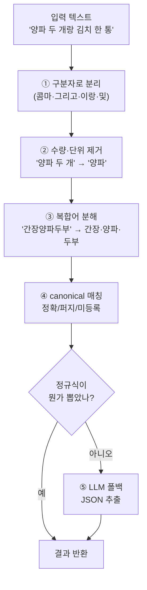
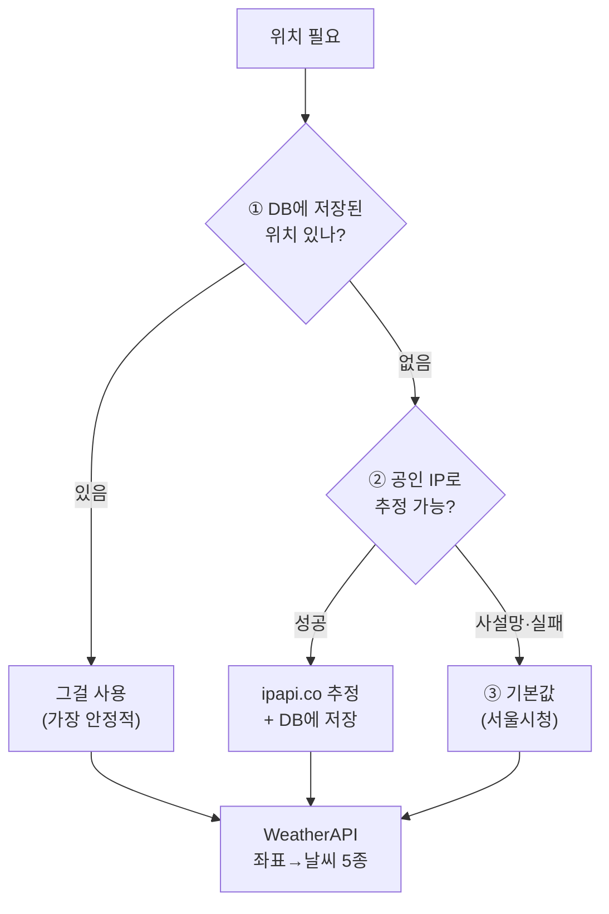

# 11. 입력 처리 · 콜드스타트 · 위치/날씨

> 추천에 들어가기 *전* 단계들입니다: ① 재료를 어떻게 텍스트에서 뽑아내나, ② 신규 사용자 취향을 어떻게 시작하나, ③ 날씨용 위치를 어떻게 정하나.

---

# 1부. 재료 파싱 파이프라인

음성("양파 두 개랑 김치 한 통")이나 영수증 텍스트를 **깨끗한 재료 이름 목록**으로 바꾸는 과정입니다. 코드: [`llm/ingredient_parser.py`](../llm/ingredient_parser.py)

## 단계별로

### ① 구분자 분리 ([ingredient_parser.py:46](../llm/ingredient_parser.py#L46))
"콤마, 그리고, 이랑, 하고, 또, 및"으로 끊습니다. 단 "이랑/랑"은 **뒤에 공백 있을 때만** — "노랑파프리카" 같은 단어가 쪼개지지 않게 보호.

### ② 수량·단위 제거 ([ingredient_parser.py:50](../llm/ingredient_parser.py#L50))
아라비아 숫자(`2개`)와 한국어 수사(`두 개`, `반 모`)를 단위 토큰과 함께 떼냅니다. "큰술"이 "술"보다, "kg"이 "g"보다 먼저 매칭되도록 **긴 토큰 우선** 정렬.

### ③ 복합어 분해 ([ingredient_parser.py:146](../llm/ingredient_parser.py#L146))
STT가 "간장 양파 두부"를 "간장양파두부"로 붙여 내보내는 경우, canonical 사전 기반 **longest-match-first**로 쪼갭니다.
> ⚠️ **완전성 가드**: 모든 글자가 canonical에 흡수돼야만 분해합니다. 한 글자라도 매칭 실패하면 원본 유지 — "고추기름"(미등록)이 ["고추","기름"]으로 잘못 쪼개지는 걸 막습니다.

### ④ canonical 매칭 + 신뢰도 ([ingredient_parser.py:173](../llm/ingredient_parser.py#L173))
실제 레시피 재료명(canonical)과 대조해 **신뢰도**를 매깁니다:

| 신뢰도 | 의미 | 예 |
|---|---|---|
| **1.0** | 정확 일치 | "양파" → 양파 |
| **0.7** | 퍼지(오타 1~2자) | "양퍄" → 양파 |
| **0.5** | 미등록(unknown) | 사전에 없는 재료 |

이 신뢰도는 확인 다이얼로그에서 색/배지로 표시되어, 사용자가 애매한 항목을 검토하게 합니다.

### ⑤ LLM 폴백 ([ingredient_parser.py:194](../llm/ingredient_parser.py#L194))
정규식이 아무것도 못 뽑으면 LLM에게 JSON 추출을 요청합니다. LLM 결과는 정규식보다 한 단계 낮은 **0.7 상한** 신뢰도. LLM이 없거나 실패하면 빈 리스트(앱은 안 죽음).

> 💡 왜 정규식 먼저? 대부분의 입력은 규칙으로 빠르고 무료로 처리되고, LLM은 정규식이 실패한 어려운 경우에만 호출 → 비용·속도 절약.

입력 경로별로 이 파서를 쓰는 정도가 다릅니다:

- **음성**: STT로 받은 텍스트를 위 정규식 4단계에 그대로 태우고, 실패 시에만 LLM 폴백([voice_input.py](../ui/voice_input.py)).
- **영수증**: 정규식 4단계를 거치지 않고 **비전 LLM(Gemini/OpenAI)으로 먼저** 이미지에서 품목을 뽑은 뒤([receipt_parser.py:35](../llm/receipt_parser.py#L35)), 공통 꼬리 단계인 정규화 매칭 + 중복 제거만 재사용합니다([receipt_input.py](../ui/receipt_input.py)).

즉 "정규식 우선, LLM은 폴백"은 **음성에만** 해당하고, 영수증은 LLM-우선입니다. 두 경로 모두 파싱 후 확인 다이얼로그 → 냉장고 저장으로 이어집니다.

---

# 2부. 콜드스타트 — 신규 사용자 취향 시작

데이터가 없는 신규 사용자의 [선호 벡터](03_glossary.md)를 **음식 카드**로 초기화합니다. 코드: [`ui/onboarding.py`](../ui/onboarding.py)

## 음식 카드 = 스타일 × 맛 격자

사용자에겐 **음식 이름만** 보이지만, 각 카드는 내부적으로 (스타일, 맛) 좌표를 가집니다. 6 스타일 × 6 맛 = **36개 카드**로 취향 공간을 고르게 덮습니다([onboarding.py:13](../ui/onboarding.py#L13)). 스타일은 코드의 `STYLE_KEYS`([normalize.py:115](../modules/normalize.py#L115))와 동일한 6종입니다:

| | 매운맛 | 담백함 | 단맛 | 짭짤함 | 고소함 | 감칠맛 |
|---|---|---|---|---|---|---|
| **메인반찬** | 제육볶음 | 두부조림 | 불고기 | 간장 닭조림 | 참깨 나물무침 | 버섯 소고기볶음 |
| **찌개** | 김치찌개 | 된장찌개 | 고추장찌개 | 참치찌개 | 들깨 순두부찌개 | 부대찌개 |
| **국/탕** | 육개장 | 맑은 콩나물국 | 단호박죽 | 미역국 | 들깨탕 | 사골국 |
| **밥/죽/떡** | 김치볶음밥 | 야채죽 | 단호박죽 | 간장계란밥 | 참깨 주먹밥 | 버섯덮밥 |
| **면/만두** | 비빔국수 | 잔치국수 | 간장비빔면 | 칼국수 | 들기름 막국수 | 만두전골 |
| **양식** | 아라비아타 파스타 | 샐러드 | 함박스테이크 | 올리브 파스타 | 까르보나라 | 버섯 크림 파스타 |

## 카드 → 선호 벡터

고른 음식의 (스타일, 맛)에 점수를 줍니다 — **비대칭**으로([onboarding.py:146](../ui/onboarding.py#L146) → [preference.init_cold_start](../modules/preference.py#L60)):
- 좋아요 음식 → 해당 스타일·맛에 **+1.0**
- 싫어요 음식 → **−0.5** (싫어요는 약한 신호)
- 같은 음식이 양쪽이면 좋아요 우선

추가로 **성별·나이대(선택)**를 받아, 기록이 쌓이기 전 [인구통계 그룹 평균](03_glossary.md)으로 추천을 보강합니다(콜드스타트 3단 폴백의 2단계). 미입력 가능.

> 💡 왜 음식 카드? 사용자에게 "매운맛 0.8 좋아하세요?"라고 직접 물으면 어렵습니다. **"김치찌개 좋아요?"**가 훨씬 자연스럽고, 내부에서 (한식, 매운맛) 차원으로 자동 변환합니다.

→ 이 벡터가 추천에서 쓰이는 법은 [04. 추천 로직](04_recommendation_logic.md)의 선호도 점수.

---

# 3부. 위치 해결 → 날씨

상황 점수의 "날씨"를 위해 사용자 위치가 필요합니다. **3단 폴백**으로 항상 좌표를 구합니다. 코드: [`location_resolver.py`](../modules/location_resolver.py)

| 순위 | 출처 | 설명 |
|---|---|---|
| 1 | **DB** | 이전에 저장된 위치(브라우저 GPS·수동·IP). 가장 신뢰 |
| 2 | **IP** | `ipapi.co`로 추정. **공인 IP만**(사설망·loopback은 건너뜀). 결과를 DB에 저장해 다음엔 1순위로 |
| 3 | **기본값** | `WEATHER_CITY` 환경변수 또는 서울시청 좌표 |

좌표가 정해지면 [`WeatherAPI`](../modules/weather_api.py)가 OpenWeatherMap을 조회해 **5종 enum**(맑음/비/눈/더위/추위)으로 분류합니다(날씨 코드 + 기온: 28°C↑ 더위, 5°C↓ 추위). 이 값이 상황 점수의 날씨 항이 됩니다([04. 추천 로직](04_recommendation_logic.md)).

> 💡 모든 단계에 폴백: 날씨 키가 없거나 API가 실패해도 "맑음"으로 안전하게 떨어지므로([context.py](../modules/context.py#L151)) 추천은 항상 동작합니다.

---

## 핵심 요약

> **입력**: 음성은 정규식 4단계(분리→단위제거→복합어분해→매칭) 후 실패 시에만 LLM 폴백, 영수증은 비전 LLM 우선(공통 정규화·중복제거 재사용). **콜드스타트**: 음식 카드(6×6 격자)로 자연스럽게 취향을 받아 비대칭(+1.0/−0.5) 벡터화. **위치**: DB→IP→기본값 3단으로 항상 좌표를 구해 날씨 5종으로 분류. 세 단계 모두 **폴백이 있어 어떤 입력·환경에서도 추천이 멈추지 않습니다.**
